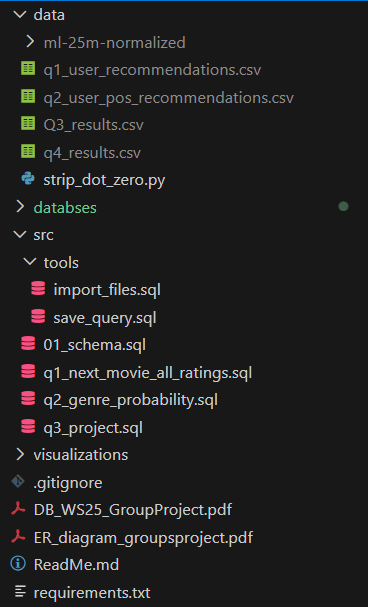

# MovieLens Next-Movie Recommender

> This project runs on **PostgreSQL** using the `psql` CLI.  
> Visualizations are produced from CSVs **exported from Postgres** after running the SQL queries.

---

## Data sources
- **Primary dataset:** MovieLens 25M (GroupLens).
- **Normalized CSV pack for quick ingest:** **<https://drive.google.com/drive/folders/1ehINXHMP-OiS-0l1pZgUueaMthsrZhlW?usp=sharing>**  
  Place the folder at `data/ml-25m-normalized/` (or point the ingest script to wherever you downloaded it).

---

## Python environment (for visualization notebooks)
```bash
python -m venv .venv
source .venv/bin/activate        # Windows: .venv\Scripts\activate
pip install -r requirements.txt


## Create schema
```bash
psql -U <user> -d movielens -f src/Schema.sql
```

## Project structure (visual)



## Import the CSV data

### Ingest with pgAdmin (no psql commands)

If you prefer to run ingestion in **pgAdmin’s Query Tool**, use the pgAdmin-friendly script:

1) Put the normalized CSVs on your computer in folder `data/`.
2) Open `src/tools/import_files.sql` and replace every occurrence of **`absolute_path/data/...`** with the full absolute path to that folder.
3) Run the script in pgAdmin.

### Otherwise:

Edit `src/tools/import_files_postgre.sql` and set the CSV directory:

```bash
\set data_dir '/absolute/path/to/your/ml-25m-normalized'
```

then run:

```bash
psql -U <user> -d movielens -f src/tools/import_files_postgre.sql
```

## Save results from queries
To save the results of queries, you can use the following commands in save_query:

```bash
psql -U <user> -d movielens -f src/tools/save_query.sql
```